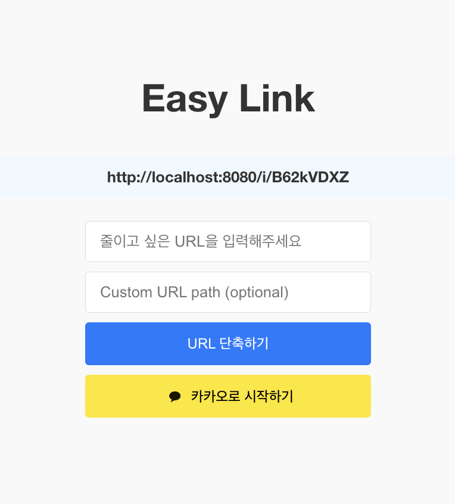
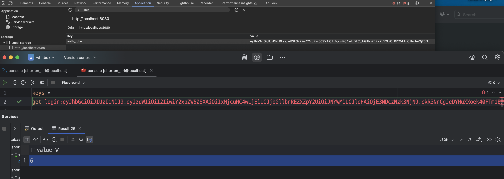
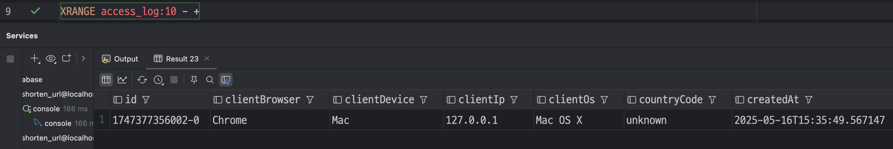

# Shorten URL Service

URL 단축 서비스 프로젝트입니다. 긴 URL을 짧은 URL로 변환하여 제공하는 서비스입니다.



## 주요 기능

- URL 단축 서비스 (비로그인/로그인 사용자)
- OAuth2 로그인, JWT 토큰 인증
- URL 접속 통계 수집


**JJWT 토큰, Redis에서 관리**



**접속 로그 저장(AS-IS MySQL, TO-DO MongoDB)**



## 기술 스택

### Frontend
- Vue.js
- Vue Router
- Vuex
- Axios

### Backend
- Java 17
- Gradle
- Spring Boot
- Spring Security
- Spring Data JPA
- MySQL
- Redis

## 프로젝트 구조

```
shorten-url/
├── front-end/     # Vue.js 프론트엔드
└── back-end/      # Spring Boot 백엔드
```

## 실행 방법

### Frontend
```bash
cd front-end
npm install
npm run serve
```

### Backend
```bash
cd back-end
./gradlew bootRun
```
